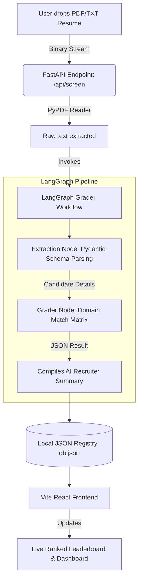

# 🧠 APEX Resume Screener — LangGraph Cognitive Talent Evaluator

APEX Resume Screener is a premium, stateful AI agent web application designed to automate resume parsing, scoring, and candidate ranking. Powered by a **FastAPI** backend, **LangGraph** cognitive flows, and the **Groq API** (`llama-3.3-70b-versatile`), it parses structural details (experience, projects, skills) and calculates granular technical fit scores (0-100) across 4 core domains.

---

## 🚀 Live Demo & Deployment
* **Live Deployment Link**: 🌐 **[Click here to view the live website](https://your-deployed-url-here.com)** *(Please replace this placeholder with your deployed URL after hosting)*
* **FastAPI Backend Host (Local)**: `http://localhost:8008`
* **Vite React Dashboard (Local)**: `http://localhost:5174`

---

## 🏗️ Architecture Workflow

The system uses a stateful agentic pipeline to extract information and grade technical competency. The diagram below illustrates the path a resume takes:



---

## 🌟 Key Features

1. **Stateful LangGraph Grader Agent**: 
   * **Node 1 (Extraction)**: Extracts contact info, work history, projects, and skills into a structured JSON schema using Llama 3.3.
   * **Node 2 (Cognitive Grading)**: Analyzes experience years, complexity, and technology stack keywords to score candidates across **Frontend**, **Backend**, **DevOps**, and **Data/AI** domains, followed by an automated **AI Recruiter Summary**.
2. **Deterministic Fallback Engine**: If no API keys are configured, the backend seamlessly falls back to a custom Python regex & rule-based parser.
3. **Dynamic Interactive Leaderboard**: 
   * Real-time sorting based on domain fit.
   * Persistence matching to lock on the active candidate during background re-fetches.
4. **Rich Aesthetic Glassmorphism UI**: 
   * Modern slate/neon theme with glowing gradients.
   * Animated **laser document scanner** when processing files.
   * Interactive tabs for Work History timeline, Projects description, and Comparison Grid table.

---

## 💻 Tech Stack

* **Backend Framework**: Python (FastAPI, Uvicorn)
* **Agentic Framework**: LangGraph, LangChain (ChatGroq client)
* **PDF Parser**: PyPDF (`PdfReader`)
* **Frontend Library**: React 18 (Vite build tool)
* **Styling**: Tailwind CSS v4.0 (Vanilla modern custom utilities)
* **Icons**: Lucide React

---

## ⚙️ Local Setup and Installation

### Prerequisites
* Python 3.10+ installed
* Node.js 18+ and `npm` installed
* A **Groq API Key** (optional, fallback engine runs automatically if empty)

---

### 1. Backend Setup

1. Open a terminal and navigate to the `backend/` directory:
   ```bash
   cd backend
   ```
2. Create and activate a Python virtual environment:
   ```bash
   # Windows PowerShell
   python -m venv .venv
   .venv\Scripts\activate
   
   # Linux/macOS
   python3 -m venv .venv
   source .venv/bin/activate
   ```
3. Install dependencies:
   ```bash
   pip install -r requirements.txt
   ```
4. Set up environment variables. Create a file named `.env` in the `backend/` folder:
   ```env
   GROQ_API_KEY=your_actual_groq_api_key_here
   ```

---

### 2. Frontend Setup

1. Return to the root directory and install npm packages:
   ```bash
   cd ..
   npm install
   ```
2. Start the Vite development server:
   ```bash
   npm run dev
   ```
   *By default, the client launches on [http://localhost:5173/](http://localhost:5173/) or [http://localhost:5174/](http://localhost:5174/).*

---

### 3. One-Click Launchers (Shortcut scripts)

For convenience, shortcut scripts are available in the project root:
* **Windows**: Double-click **`run.bat`** to activate the virtual environment and boot the FastAPI backend automatically on port `8008`.
* **Linux/macOS**: Execute **`./run.sh`** to launch the backend server.

---

## 🛠️ Verification & API Specifications

* **Get Ranked Candidates**: `GET /api/candidates?sortBy=overallScore` (Supports sorting by `overallScore`, `frontend`, `backend`, `devops`, or `dataAi`).
* **Screen New Resume**: `POST /api/screen` (Accepts multipart `file` uploads for PDF or TXT).
* **Reset Database**: `POST /api/candidates/reset` (Reloads default sandbox candidates).
* **Clear Leaderboard**: `DELETE /api/candidates` (Empties database).
